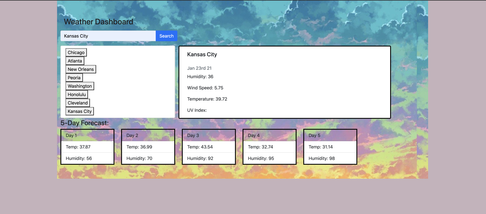

# weather-dashboard

## Table of Contents 
* [Installation](#installation)
* [User Story](#story)
* [Acceptance Criteria](#criteria)
* [Usage](#usage)
* [Deployed Link](#deployed)

## Installation
* Develop and design index.html page using a CSS framework 
* In index.html include javascript and jQuery tags and link to style.css and javascript files
* In javascript file use generated API key and call API key to get relative data
* Select elements from the index.html and manipulate the DOM using a combination of jQuery and javascript
* Input API information into elements by mapping their relative path 
* Store information collected into the local storage. Information is based on user input. 
* Get the information from local storage and display information from when page is loaded
* When the search history is clicked on the left hand side of the page, call cityInput function to grab information again for respective city 


## Story

```
AS A traveler
I WANT to see the weather outlook for multiple cities
SO THAT I can plan a trip accordingly
```

## Criteria

```
GIVEN a weather dashboard with form inputs
WHEN I search for a city
THEN I am presented with current and future conditions for that city and that city is added to the search history
WHEN I view current weather conditions for that city
THEN I am presented with the city name, the date, an icon representation of weather conditions, the temperature, the humidity, the wind speed, and the UV index
WHEN I view the UV index
THEN I am presented with a color that indicates whether the conditions are favorable, moderate, or severe
WHEN I view future weather conditions for that city
THEN I am presented with a 5-day forecast that displays the date, an icon representation of weather conditions, the temperature, and the humidity
WHEN I click on a city in the search history
THEN I am again presented with current and future conditions for that city
WHEN I open the weather dashboard
THEN I am presented with the last searched city forecast
```
## Usage


## Deployed
 https://sfinck.github.io/weather-dashboard/

